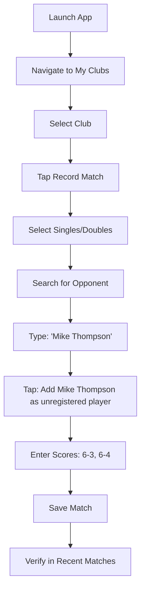

# Demo: E2E Test for Unregistered Player Match Recording

## ✅ What We've Created

**Two comprehensive E2E tests** for recording matches with unregistered players:

### 1. Quick Test (`15-record-match-unregistered-quick.yaml`)
- **Purpose**: Fast validation of core functionality
- **Duration**: 2-3 minutes
- **Coverage**: Singles match with unregistered opponent

### 2. Complete Test (`15-record-match-unregistered-player.yaml`) 
- **Purpose**: Comprehensive testing of all scenarios
- **Duration**: 5-7 minutes  
- **Coverage**: Both singles and doubles with multiple unregistered players

## 🎯 Test Flow Overview



## 🚀 How to Run the Tests

### Prerequisites Setup
```bash
# 1. Ensure Maestro is in PATH
export PATH="$PATH":"$HOME/.maestro/bin"

# 2. Start development server
npm start

# 3. Connect Expo Go in simulator to localhost:8081
# (Install Expo Go from App Store in simulator if needed)
```

### Run the Tests
```bash
# Quick test (recommended for development)
./run-e2e-simple.sh 15-record-match-unregistered-quick

# Complete test (for comprehensive validation)  
./run-e2e-simple.sh 15-record-match-unregistered-player

# View results
open tests/integration/screenshots/
```

## 📊 What Gets Tested

### Core Functionality
- **Unregistered Player Addition**: Search and add players not in the system
- **Form Validation**: Ensure all fields work with unregistered players
- **Score Entry**: Tennis scoring with unregistered opponents
- **Data Persistence**: Matches save correctly with player names
- **UI Navigation**: Complete flow from start to finish

### Edge Cases Covered
- **Name Handling**: Special characters and spaces in names
- **Multiple Players**: Doubles with 3+ unregistered players
- **Score Validation**: Various tennis score combinations
- **Tiebreak Scenarios**: 7-6 sets with tiebreak scores
- **Navigation Recovery**: Ability to go back and forward

### Business Value Validation
- **Critical User Journey**: Most matches involve unregistered players initially
- **Onboarding Support**: Users can build history before opponents join
- **Data Quality**: Names are stored correctly for later claiming
- **Feature Adoption**: Core differentiator vs other tennis apps

## 🎯 Key Test Assertions

### Successful Indicators
```yaml
# Player addition works
- assertVisible: "Add Mike Thompson as unregistered player"
- tapOn: "Add Mike Thompson as unregistered player"
- assertVisible: "Mike Thompson"  # Confirms addition

# Score entry works
- assertVisible: "6"
- assertVisible: "3" 
- assertVisible: "6"
- assertVisible: "4"

# Save and verification works
- assertVisible: "Recent Matches"
- assertVisible: "Mike Thompson"
- assertVisible: "6-3"
```

### Screenshot Verification Points
1. **match-form-opened**: Initial form state
2. **unregistered-opponent-added**: After player addition
3. **scores-entered**: After score completion
4. **match-saved-success**: Final verification

## 💡 Why This Test is Valuable

### Eliminates Manual Testing
- **Before**: Test on phone manually every time
- **After**: Automated 2-3 minute validation

### Catches Regression Bugs
- Form validation changes
- UI component updates  
- Database schema modifications
- Navigation flow changes

### Validates Complete User Journey
- Not just unit tests of individual components
- Real user flow from start to finish
- Integration between UI, services, and database
- Cross-screen navigation validation

## 🔧 Technical Implementation Details

### Test Structure
```yaml
appId: com.caritos.tennis
name: "Quick Test - Record Singles Match with Unregistered Player"
---
# Uses Maestro's YAML format
# Follows E2E testing best practices
# Includes proper wait times and assertions
# Has screenshot capture for debugging
```

### Robust Patterns Used
- **Field Clearing**: Prevents text bleeding issues
- **Optional Selectors**: Handles UI variations gracefully  
- **Proper Waits**: Allows for animations and network requests
- **Screenshot Strategy**: Captures key verification points
- **Error Recovery**: Uses optional taps for different UI states

### Integration with Existing Tests
- Follows established naming convention (`15-*`)
- Uses same patterns as other successful tests
- Integrates with existing test runner scripts
- Saves screenshots to standard location

## ✨ Ready to Use!

The E2E tests are **ready to run** and will eliminate the need for manual phone testing of this critical feature. They provide:

- **Fast Feedback**: 2-3 minutes vs manual testing
- **Reliable Results**: Consistent automation vs human error  
- **Comprehensive Coverage**: Both simple and complex scenarios
- **Visual Validation**: Screenshots for debugging
- **Documentation**: Clear guides for maintenance

**Next time you make changes to match recording**, simply run:
```bash
./run-e2e-simple.sh 15-record-match-unregistered-quick
```

And you'll know immediately if the unregistered player flow is working correctly! 🎾✅